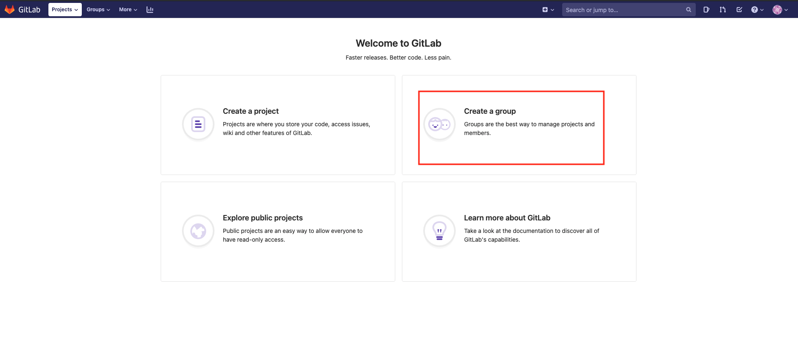
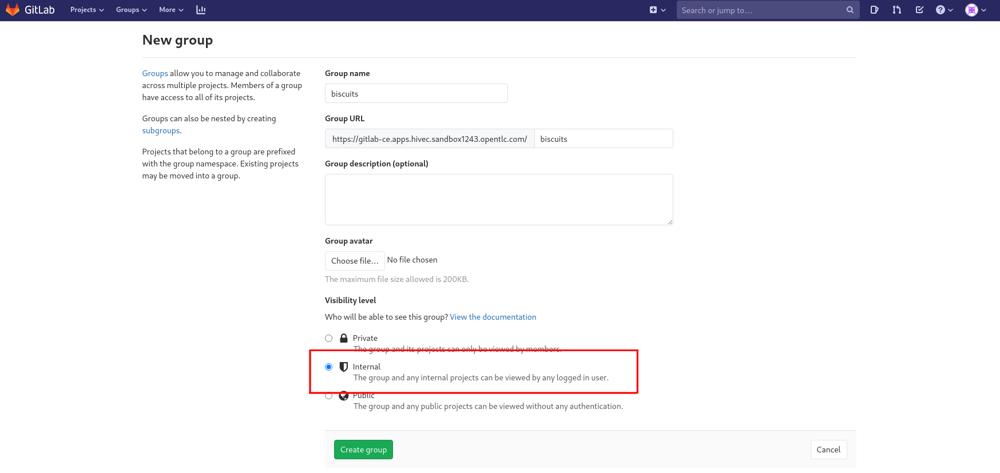
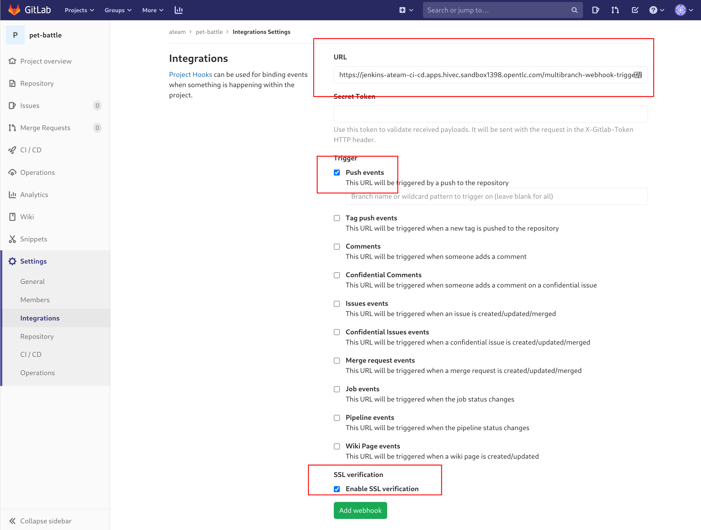
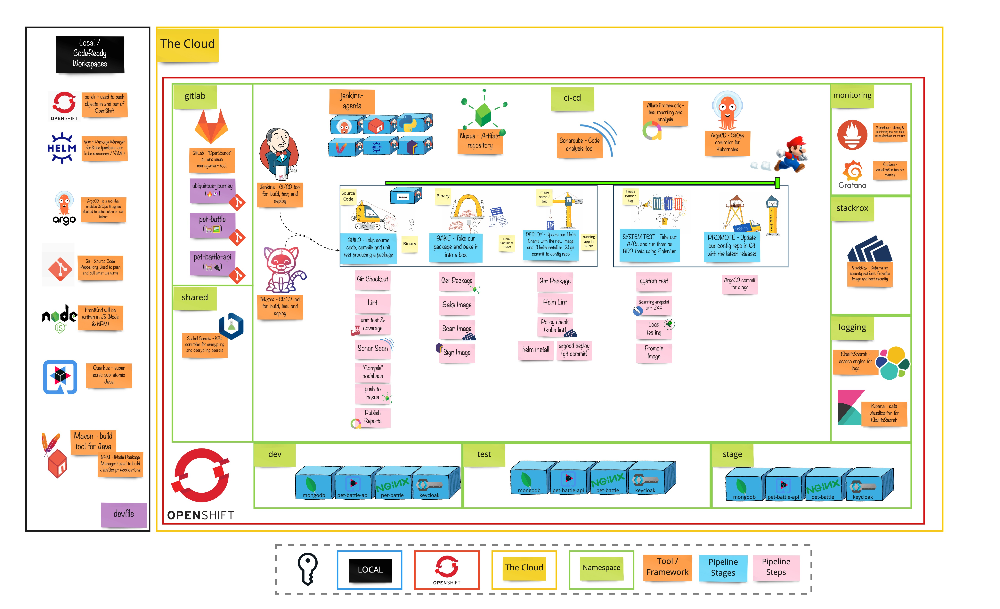

## Automation
_something something about automation and CICD_

### Setup CICD toolings
Manually installating the application via helm charts is useful for learning and maybe setting up a one-time debugging environment. But as everyone would agree, it is not realistic to do this manually. So let's set up automated CICD infrastructure for PetBattle. (How to build automated pipelines is covered in TL500: https://rht-labs.com/tech-exercise/#/ )

### Install toolings
1. ArgoCD installation as GitOps tool:

```bash
helm repo add redhat-cop https://redhat-cop.github.io/helm-charts
```

```bash
cat << EOF > /projects/tech-exercise/argocd-values.yaml
namespace: ${TEAM_NAME}-ci-cd
argocd_cr:
  namespaceRoleBinding:
    enabled: true
  applicationInstanceLabelKey: rht-labs.com/${TEAM_NAME}
  repositoryCredentials: |
    - url: https://gitlab-ce.${CLUSTER_DOMAIN}
      type: git
      passwordSecret:
        key: password
        name: git-auth
      usernameSecret:
        key: username
        name: git-auth
EOF
```

```bash
helm upgrade --install argocd \
  --create-namespace --namespace ${TEAM_NAME}-ci-cd \
  -f /projects/tech-exercise/argocd-values.yaml \
  redhat-cop/argocd-operator
```

#### Get GitLab Ready for GitOps
1. Log into GitLab with your credentials. GitLab URL:
```
https://gitlab-ce.<CLUSTER_DOMAIN>
```
We need to create a group in GitLab as <TEAM_NAME>.  Click "Create a group" on the screen:


2. Put your TEAM_NAME (`<TEAM_NAME>`) as the group name, select **Internal** for Visibility level, and hit Create group. This is so we can easily share code and view other teams' activity.


3. Now lets create the git repository that we are going to use for <span style="color:purple;" >GIT</span>Ops purposes. The `sre-enablement` will serve as a mono-repo holding both our tooling configuration and the application definitions and some other stuff. In the real world, you may want to separate these into different repos! Anyways, hit `New project` button on the right hand side

 
4. On the new view, use `sre-enablement` as Project Name, select **Internal** for Visibility level, then hit Create project. Make sure the project is in the group you created previously and not the username's.


5. Let's push our code to the GitLab server. Back in your CodeReady Workspace, open a terminal if you have not got one open.
```bash
cd /projects/sre-enablement
```
```bash
git remote set-url origin https://gitlab-ce.${CLUSTER_DOMAIN}/${TEAM_NAME}/sre-enablement.git
```
```bash
git add .
git commit -am "🐙 ADD - argocd values file 🐙"
```
```bash
git push -u origin --all
```

#### Deploy Toolings
1. In order to deploy PetBattle through a pipeline, we need Jenkins (or Tekton) and Nexus for starter.

If you look at `tech-exercises/ubiquitous-journey/values-tooling.yaml` file, the tools are listed there. We deploy tools through GitOps as well.

We just need to enable Application of Applications (Ubiquitous Journey) definition in `values.yaml` file.

```yaml
...
applications:
  # Tooling to support CI/CD
  - name: ubiquitous-journey
    enabled: false #Enable this by changing to true
    source_path: "."
    helm_values:
      - ubiquitous-journey/values-tooling.yaml
```
2. Now push the changes into your git repository!

```bash
git add .
git commit -m  "🦘 UPDATE - uj is enabled 🦘" 
git push 
```

#### Deploy PetBattle
### Setup Pet Battle Git Repositories
1. Open the GitLab UI. Create a repo in GitLab under `<TEAM_NAME>` group called `pet-battle`. Make the project as public.


2. Push the PetBattle Frontend code to this new repository.
```bash
cd /projects
git clone https://github.com/rht-labs/pet-battle.git && cd pet-battle
git remote set-url origin https://gitlab-ce.${CLUSTER_DOMAIN}/${TEAM_NAME}/pet-battle.git
git branch -M main
git push -u origin main
```

3. We want to be able to tell Jenkins to run a build for every code change - welcome our good ol' friend the Webhook. Just like we did with ArgoCD earlier, let's add a webhook to GitLab for our Pet Battle front end so every commit triggers it. Jenkins needs a url of the form `<JENKINS_URL>/multibranch-webhook-trigger/invoke?token=<APP_NAME>` to trigger a build:

```bash
# handy command to generate the url needed for the webhook :P
echo "\n https://$(oc get route jenkins --template='{{ .spec.host }}' -n ${TEAM_NAME}-ci-cd)/multibranch-webhook-trigger/invoke?token=pet-battle"
```



#### Setup PetBattle GitOps Config
1. Enable PetBattle application of application definition for stage and prod environments. Open `values.yaml` file under `tech-exercise` folder and **swap** `enabled: false` to `enabled: true` as shown below:

<pre>
  # Test app of app
  - name: test-app-of-pb
<strong>    enabled: true</strong>
    helm_values:
      - pet-battle/test/values.yaml

  # Staging App of Apps
  - name: staging-app-of-pb
<strong>    enabled: true</strong>
    helm_values:
      - pet-battle/stage/values.yaml
</pre>

As you experienced, PetBattle consists of multiple apps. We define the list of apps we want to deploy in the `applications` property in our `pet-battle/prod/values.yaml`.

Let's add a keycloak service to this list by appending to it as follows. This will take the helm-chart from the repo and apply the additional configuration to it from the `values` section. Make sure to replace <CLUSTER_DOMAIN> with your value.

```yaml
  # Keycloak
  keycloak:
    name: keycloak
    enabled: true
    source: https://github.com/petbattle/pet-battle-infra
    source_ref: main
    source_path: keycloak
    values:
      app_domain: <CLUSTER_DOMAIN>
      ignoreHelmHooks: true
```
*Please make sure your text is aligned with the existing placeholder comments.*
It's not real unless its in git!
```bash
# git add, commit, push your changes..
git add .
git commit -m  "🐰 ADD - app-of-apps and keycloak to test 🐰" 
git push 
```

With the values enabled, let's update the helm chart for our petbattle tooling and now apps also.
```bash
helm upgrade --install uj --namespace ${TEAM_NAME}-ci-cd .
```

Now that the infra for PetBattle is up and running, let's deploy PetBattle itself. 
In your IDE, open up the `pet-battle/prod/values.yaml` file and copy the following:

```yaml
  # Pet Battle Apps
  pet-battle-api:
    name: pet-battle-api
    enabled: true
    source: https://petbattle.github.io/helm-charts  # http://nexus:8081/repository/helm-charts
    chart_name: pet-battle-api
    source_ref: 1.1.0 # helm chart version
    values:
      image_name: pet-battle-api
      image_version: latest # container image version

  pet-battle:
    name: pet-battle
    enabled: true
    source: https://petbattle.github.io/helm-charts  # http://nexus:8081/repository/helm-charts 
    chart_name: pet-battle
    source_ref: 1.0.6 # helm chart version
    values:
      image_version: latest # container image version
```
Remember the values you had to change for helm-charts? This is the point where we can override those values and manage them outside of the code.

```bash
cd /project/sre-enablement/tech-exercise
cat << EOF >> pet-battle/prod/values.yaml
      config_map: '{
        "catsUrl": "https://pet-battle-api-${TEAM_NAME}-prod.${CLUSTER_DOMAIN}",
        "tournamentsUrl": "https://pet-battle-tournament-${TEAM_NAME}-prod.${CLUSTER_DOMAIN}",
        "matomoUrl": "https://matomo-${TEAM_NAME}-ci-cd.${CLUSTER_DOMAIN}/",
        "keycloak": {
          "url": "https://keycloak-${TEAM_NAME}-prod.${CLUSTER_DOMAIN}/auth/",
          "realm": "pbrealm",
          "clientId": "pbclient",
          "redirectUri": "http://localhost:4200/tournament",
          "enableLogging": true
        }
      }'
EOF
```

Push the changes:
```bash
# git add, commit, push your changes..
cd /project/sre-enablement/
git add .
git commit -m  "🐩 ADD - pet battle apps 🐩" 
git push 
```
### Pipelines
There is a pipeline in place for PetBattle which has all these stages. If you look at Big Picture closely, you'll see that the pipeline is deploying apps into dev, test and stage environments after passing all these steps. We will keep production pipeline separately. 



Production pipeline doesn't run build or bake stages again. You can think stage environment as a copy of future-production. All prod pipeline will have to do is deploy new images (and configs if applicable) into ${TEAM}-prod namespace.  

Let's create the pipeline (by overridign existing pipeline in the repo)

```bash
cd /projects/
cp sre-enablement/tech-exercise/Jenkinsfile.prod pet-battle/Jenkinsfile
cp sre-enablement/tech-exercise/Jenkinsfile.prod pet-battle-api/Jenkinsfile
```

Push the changes:
```bash
# git add, commit, push your changes..
cd /project/pet-battle
git add Jenkinsfile
git commit -m  "🐩 ADD - prod Jenkinsfile 🐩" 
git push 
```

```bash
cd /project/pet-battle-api
git add Jenkinsfile
git commit -m  "🐩 ADD - prod Jenkinsfile 🐩" 
git push 
```

🪄 Observe the pipeline runs smoothly. 🪄
### Defining Toil
For this process, have you identify any toil? What would you automate further and why? 