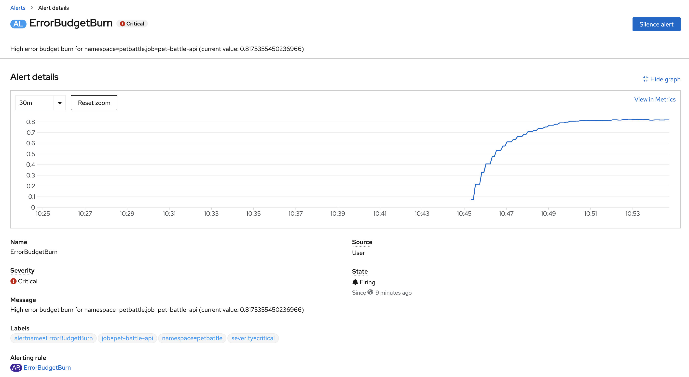

### PetBattle SLOs
Let's take each SLI and set a realistic objective.

```yaml
User Journey: Uploading Cat Photos 
SLI Type: Availability 
SLI Specification: Request to access PetBattle complete successfully
SLI Implementations:  
  - measured from the UI metrics.  
  - measured by probers that execute javascript in a browser.  
SLO:
  99% of page requests in the past 28 days served are successfull  (ie status code is not 5xx).
```
#### Alerts on SLOs
*inspired by https://sre.google/workbook/alerting-on-slos/ and https://developers.soundcloud.com/blog/alerting-on-slos*

We will use Prometheus and Alert Manager to track SLOs and get alert if we are about to burn error budgets. We will follow `Multiwindow, Multi-Burn-Rate Alerts` to generate alerts and based on its severity we either get ticket or pages. Here is an example:

```yaml
- alert: ErrorBudgetBurn
      annotations:
        message: 'High error budget burn for namespace=petbattle,job=pet-battle-api (current value: {{ $value }})'
      expr: |
        sum(http_server_requests_seconds_count:burnrate2h{namespace="petbattle",job="pet-battle-api"}) > (3.00 * (1-0.99900))
        and
        sum(http_server_requests_seconds_count:burnrate1d{namespace="petbattle",job="pet-battle-api"}) > (3.00 * (1-0.99900))
      for: 1h
      labels:
        job: pet-battle-api
        namespace: petbattle
        severity: warning
  # Other rules accordingly with 5m replaced by 30m, 1h, 2h, 6h, 1d, 3d.
  ```

[TODO] more details on the rules and alerts

To create such rules, we will use some Jsonnet libraries. Take a look at `tech-exercise/observability/prometheusrule.jsonnet` file.

[TODO] add guidance to update the namespace accordingly
```yaml
        name: 'pet-battle-api.slos-prod.rules',
        local errorburnrate = slo.errorburn({
        alertName: 'ErrorBudgetBurn',
        metric: 'http_server_requests_seconds_count',
        selectors: ['namespace="petbattle"', 'job="pet-battle-api"'],
        target: 0.99,  // 99%
```
It creates alerts based on the SLI (`http_server_requests_seconds_count`) and SLO (`0.99`) we have chose. 

Following commands will create the prometheus rule at `prometheusrule.yaml` file.
```bash
jb update
jsonnet -J vendor/ prometheusrule.jsonnet | gojsontoyaml > prometheusrule.yaml
```

Now let's apply the rules:
```bash
oc apply -f /projects/tech-exercise/observability/prometheusrule.yaml -n ${TEAM_NAME}
```

and to verify, let's call a faulty endpoint:

```bash
echo https://pet-battle-api-${TEAM_NAME}.${CLUSTER_DOMAIN}/cats?failMe=500 | xargs -P 10 -n 1 curl
```

After some time, you'll see an alert in OpenShift UI:


