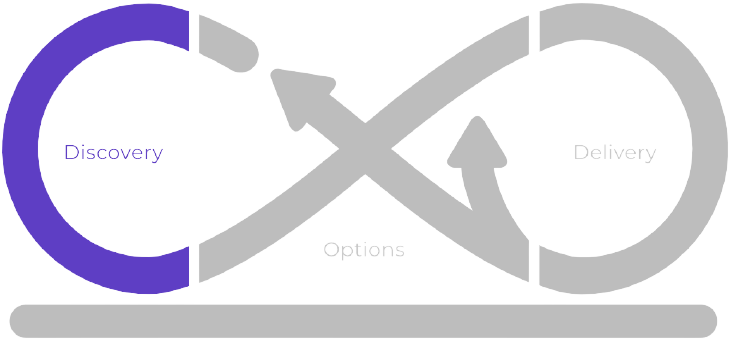
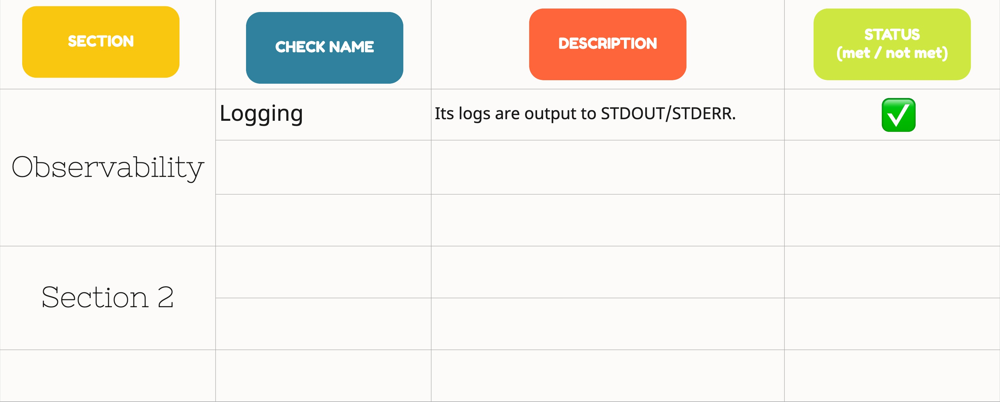

### Before Onboarding PetBattle
In our scenario, PetBattle is already serving to the endusers. You can use PRR to identify the improvement points, do a prioritization with the product team and create a backlog.

### What do you need to create PRR?
Well, not much :) This is a checklist that you go through in order to confidently answer "is this service ready for live customer requests?". Start defining what sort of checkpoints make your team say "YES!" to this question. Create a table based on the check points and group them. Add some details to explain what do you expect from that check. And remember, as everything, this is also a process which means it'll evolve over time.

Here is an example board to get you start.

It is important for this list to be available to the whole organization so that other teams can also assess their services before requesting SRE support, or it would be just as useful for them to improve their services. Maybe you can help them to see a point that they haven't thought before. 
Now go through your list to assess PetBattle and if any, decide what is next for your adventure.
### Create a PRR for the infrastructure
Is your platform production ready? It would also be useful to have a PRR for your platform that PetBattle is running on.
### Bonus: Can you automate this process? 
Discuss within your team if there is any checks that you can automate and throw some ideas to investigate more for your reliability backlog.

⛷️ <b>NOTE</b> ⛷️ - Your organization could have a separate platform engineering team along side the SRE team. Maybe call this out?

